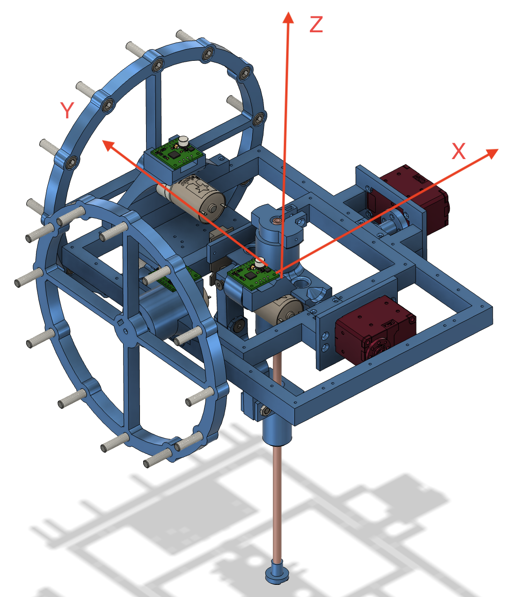

# Classic Hopper Design

### Connections

We have 3 motor controllers

| Connections                        | Puller | Reaction Wheel X | Reaction Wheel Y |
|------------------------------------|---------|---------|---------|
| PWM1                               | 12 (PWM6 A)     |  0 (PWM0 A)     | 1  (PWM0 B)      |
| PWM2                               | 11 (PWM5 B)     | 2 (PWM1 A)      | 3 (PWM1 B)      |
| OCM                                | A0 (GP26)      | NONE?       |  NONE?       |
| DIAG                               | 13       | 4       |   5    |
| EN                                 | 10       | 6       |  7     |

And we have the foot sensor pin on 27 (ADC1). Since there are only 3 ADCs, that means I cannot connect the OCM for all 3 motors... 

